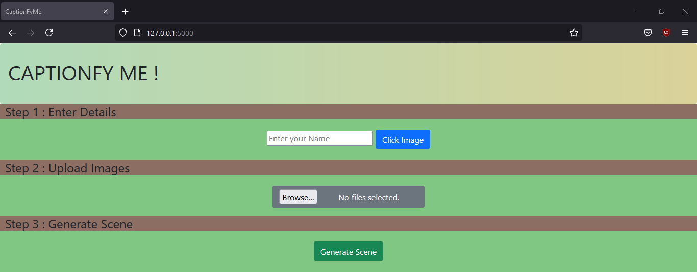
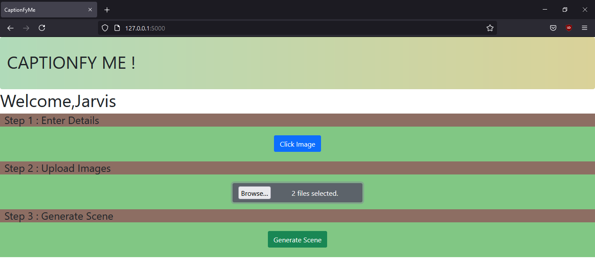
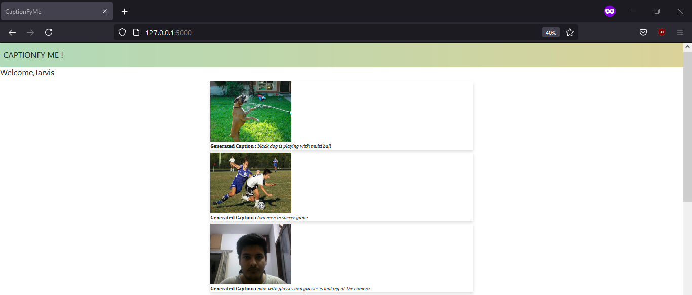

# CaptionFyME
A flask web application that generates caption for input Images.A user can also click image for input. The application uses a LSTM based model for generating image captions wherein Flickr8k dataset was used for training, ResNet-50 for feature extraction and glove6B.50.d for word embeddings.

### Tech Stack
- Keras
- Flask
- Python
- OpenCV
- Bootstrap

### Results

